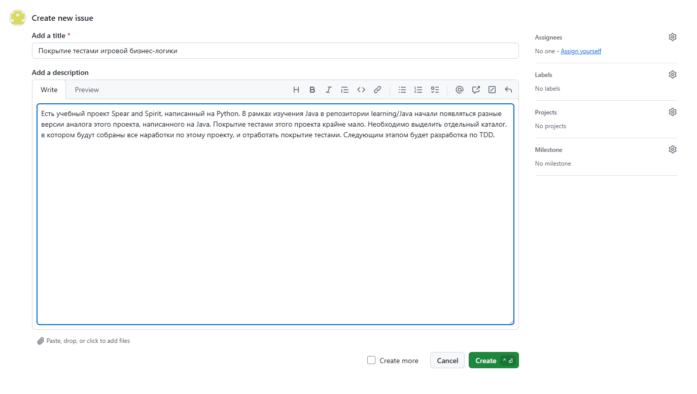
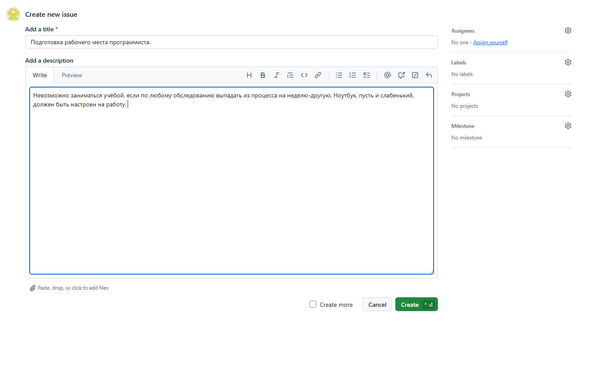
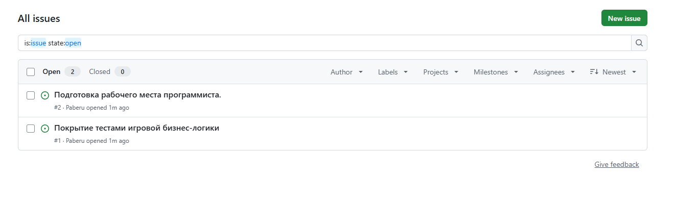
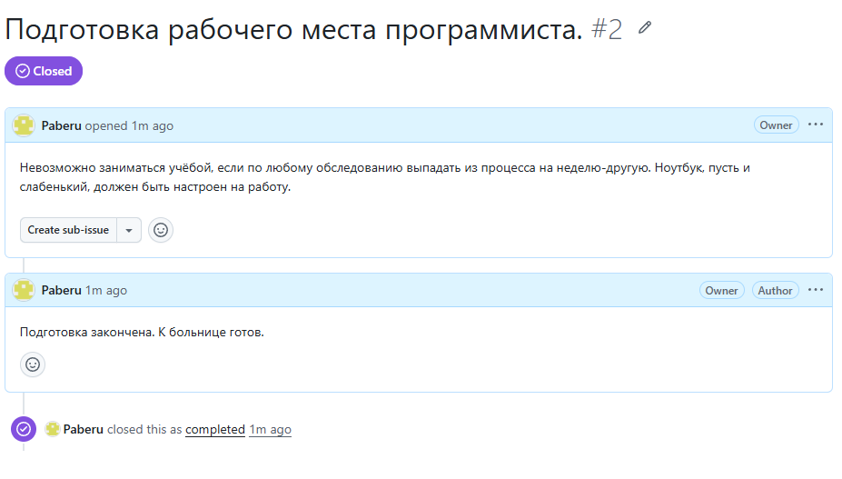
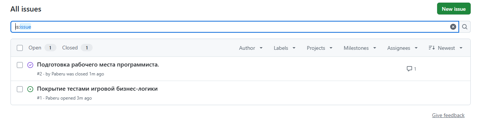

# Использование GitHub Issues

Попробовал поразбираться с GitHub Issues, на моём уровне вовлечённости в процесс профессиональной разработки этого инструмента более, чем достаточно

Создание задачи по покрытию проекта тестами:

Создание задачи по подготовке рабочего места программиста:

Окно открытых задач:

Закрытие задачи по подготовке рабочего места программиста:

Отображение всех задач, как открытых, так и закрытых

