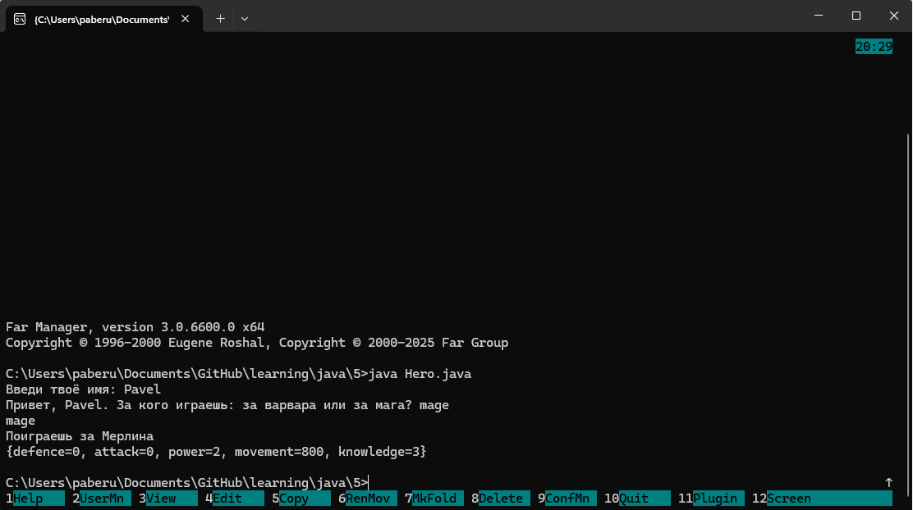
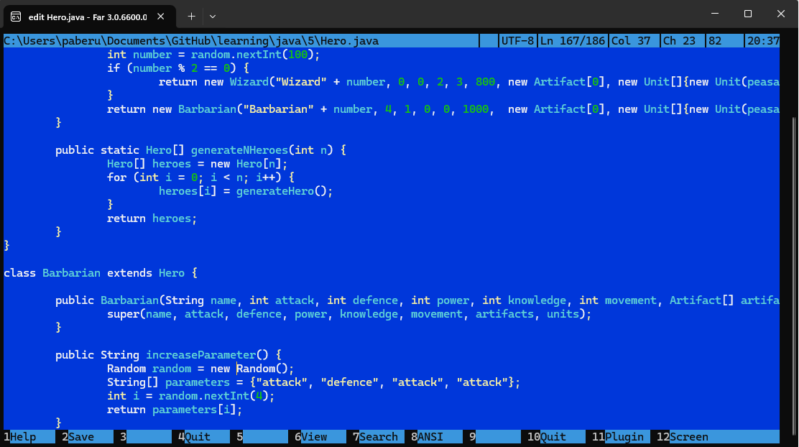

# Файловый менеджер Far.

Когда-то давно мне было очень удобно пользоваться far-ом, но после этого был долгий период использования Total Commander, где всё, в принципе, похоже, но более настраиваемо и в целом к нему я достаточно быстро привык.

Потом было несколько лет использования Linux, где частичный ввод и клавиша Tab творят невероятные чудеса, поэтому файловый менеджеры мне надолго стали неинтересны. Впоследствии мне пришлось поставить Windows, т.к. многие проприетарные продукты запускать через wine - тот ещё геморрой, и мой опыт работы в консоли Linux подтолкнул меня к использованию командной строки или PowerShell. Но для удобной манипуляции большими объёмами файлов я снова вернулся к использованию TotalCommander. В принципе, лишний раз вспомнить работу с Far может быть будет и нелишним.

