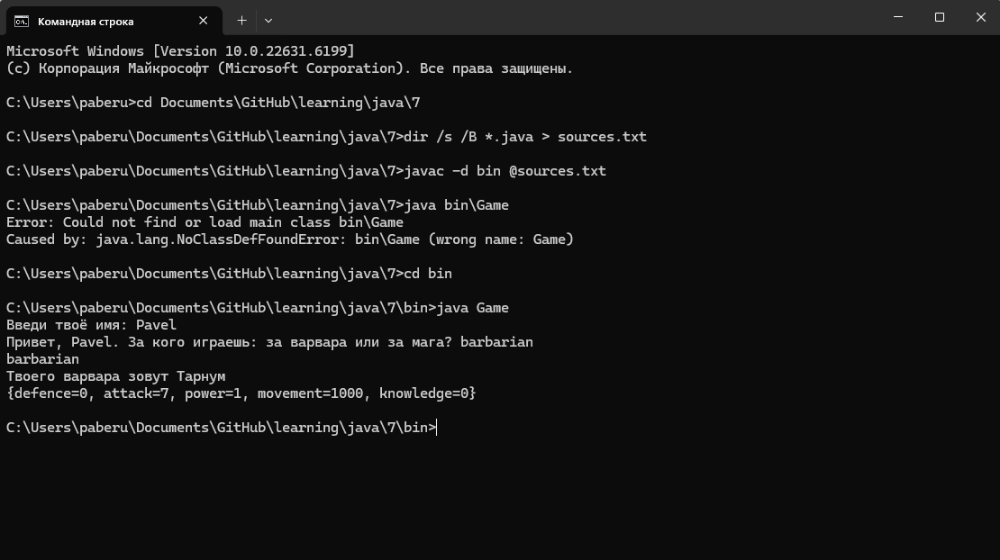
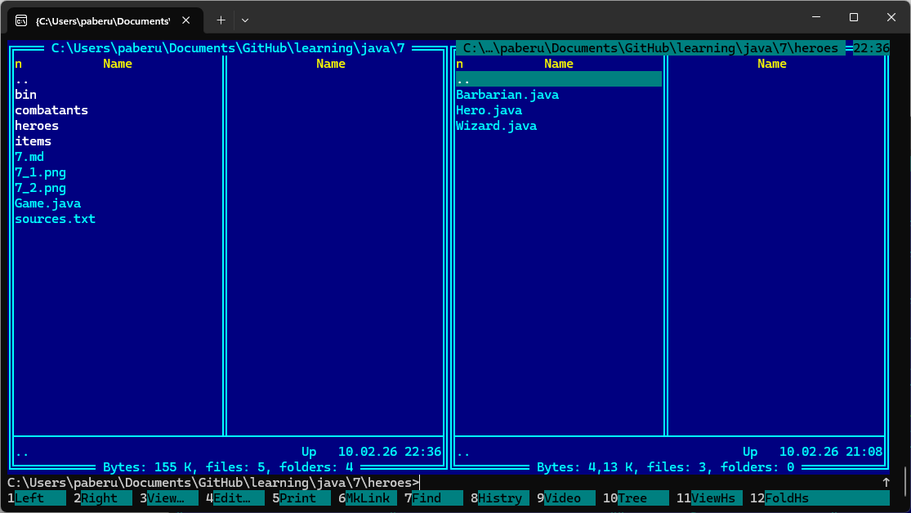
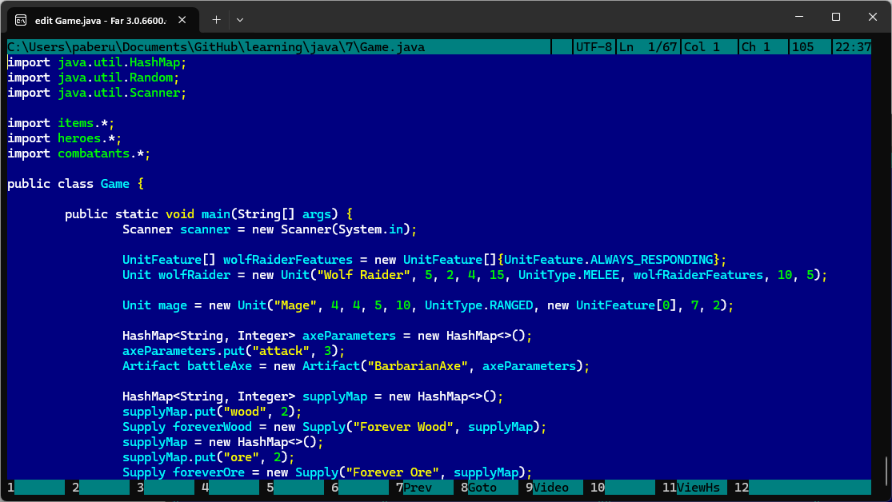

# Пакеты Java.

У меня получилось собрать классы моего проекта в три пакета: heroes - для класса Hero и его потомков, combatants - для класса Unit, его потомков и вспомогательных АТД, items - для класса Artifact и для его потомков.

При это в классе Hero активно используются объекты класса Artifact, т.к. носимые артефакты улучшают показатели героя, и в то же время все три пакета активно используются в методе main класса Game.

Программа собирается и запускается:

Все аккуратно разложено по пакетам, включая отдельный каталог bin для class-файлов:

Часть содержимого класса Game:

