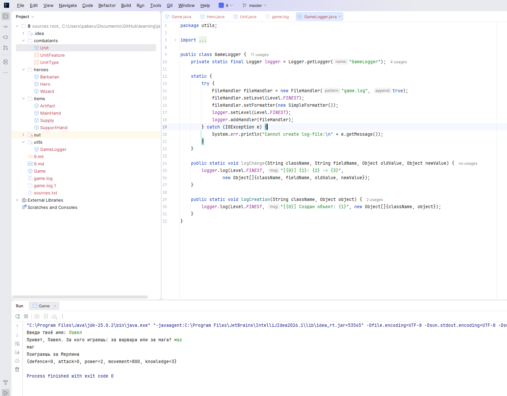
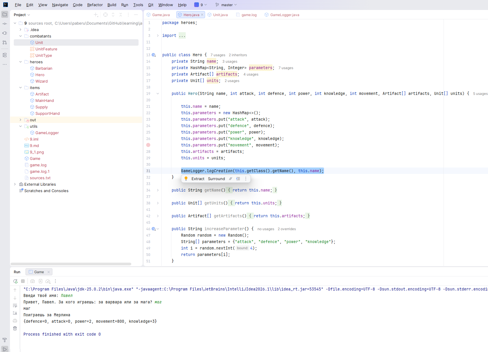
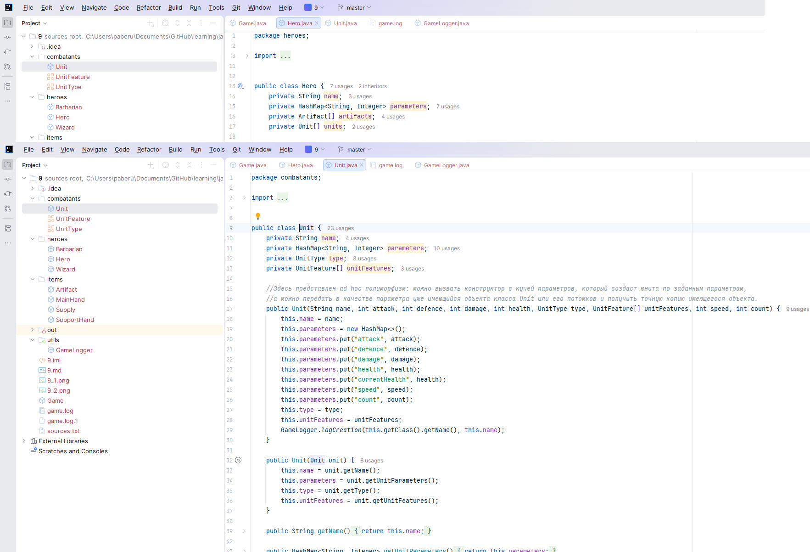
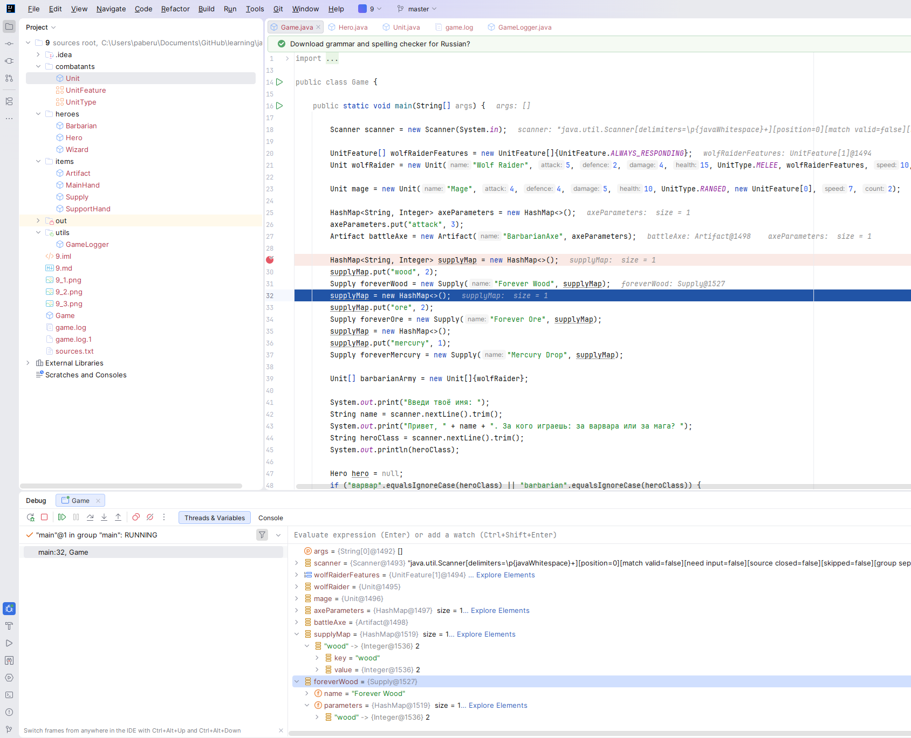
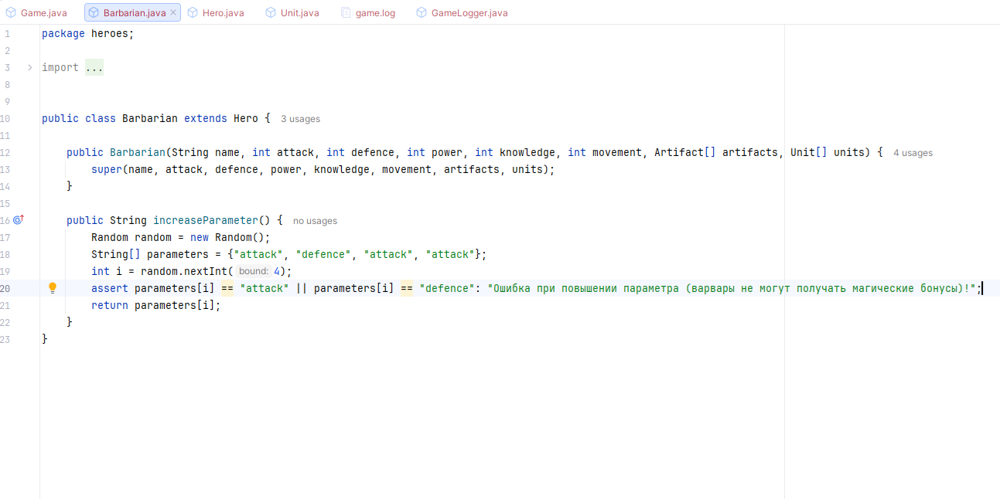
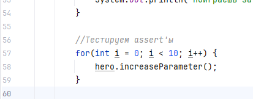

# Отладка и логирование.

У нас на работе использовался IBM MQ Series, написанный на Java. Там логировалось всё настолько подробно, что при сбое не всегда было понятно, что и как искать в первую очередь. Я решил создать статический класс утилиты журналирования, который будет журналировать создание всех объектов и, впоследствии, некоторые особо важные изменения (например, получение урона юнитами).

Код класса утилиты журналирования:

Применение журналирования при создании героя:

Применение журналирования при создании юнита:

Использование точек прерывания при запуске главной функции проекта:

Создаю assert для проверки абсурдной ситуации:

Вызываю функцию 10 раз, чтобы проверить, что assert не сработает:
